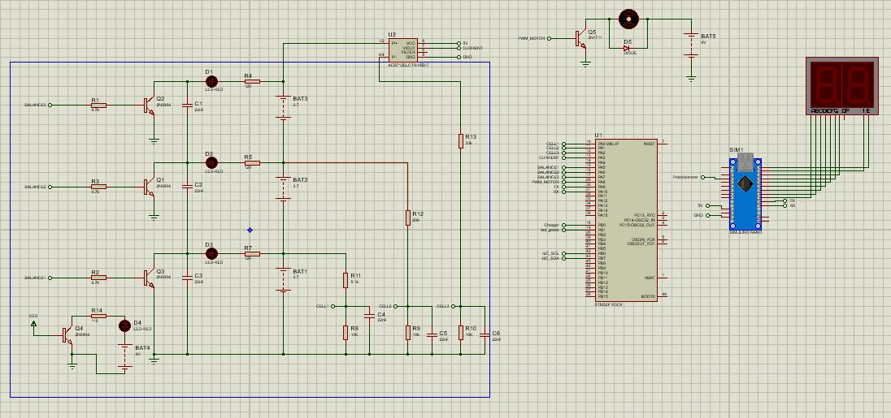
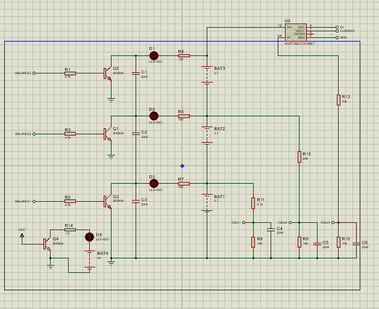
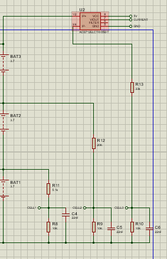
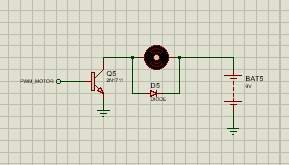
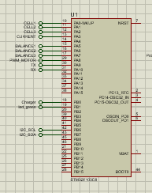
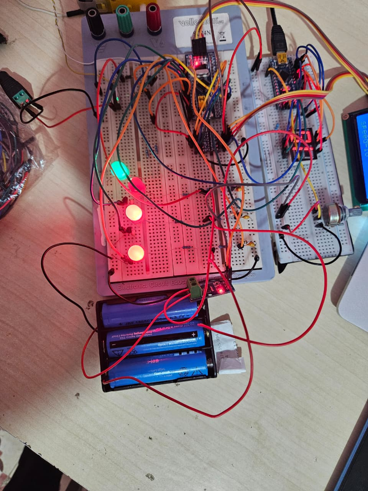

# Battery Management System (BMS) — Lithium 3S

## Vue d’ensemble du système

Le Mini BMS (Battery Management System) est conçu pour surveiller et protéger un pack de batteries lithium-ion utilisé dans des systèmes embarqués et de robotique.

Le système garantit un fonctionnement sûr en surveillant en continu les paramètres électriques essentiels et en appliquant des protections lorsque nécessaire.

### $ Fonctions principales :
- Surveillance des tensions de chaque cellule
- Détection des surtensions et sous-tensions
- Protection de la batterie contre les états de charge/décharge dangereux
- (Optionnel) Mesure du courant pour le contrôle de charge
- Sécurisation du fonctionnement des packs de batteries lithium

### Configuration de la batterie :
- Pack de batteries lithium-ion (exemple : configuration 3S / 4S)
- Tension nominale : dépend de la configuration utilisée
- Utilisation : systèmes embarqués et robotique

### Principe de fonctionnement :
1. Le système mesure en continu les tensions des cellules  
2. Il compare les valeurs aux seuils de sécurité définis  
3. En cas d’anomalie (surtension ou sous-tension) :  
   - La charge ou la décharge est coupée  
4. Le système revient au fonctionnement normal lorsque les tensions redeviennent sûres  

### Avertissement de sécurité :
Les batteries lithium sont sensibles et peuvent être dangereuses en cas de mauvaise utilisation.  
Ce système permet de réduire les risques, mais des tests et une manipulation correcte restent indispensables.

Système de gestion de batterie lithium 3 cellules (3S) développé sur **STM32 Blue Pill** avec supervision en temps réel, protections actives, équilibrage passif et contrôle moteur via PWM.



---

## Fonctionnalités

- Surveillance en temps réel : tension par cellule, tension pack, courant
- Protections : surtension, sous-tension, surcourant
- Équilibrage cellulaire passif (Cell Balancing)
- Contrôle de vitesse moteur via PWM (TIM1)
- Affichage LCD I²C (tensions, courant, vitesse)
- Communication UART avec Arduino (commande de vitesse)
- Affichage 7 segments (vitesse côté Arduino)

---

## Architecture du système

Le système est composé de deux microcontrôleurs qui communiquent via UART :

```
[Arduino UNO]  ──UART──►  [STM32 Blue Pill]
  Potentiomètre               ADC (mesure cellules)
  Affichage 7 seg             PWM moteur
  Envoi vitesse               Équilibrage + protections
                              LCD I²C
```

---

## ⚡ Bloc BMS — Mesure & Protection & Balancing



### Mesure des tensions cellules
Les 3 cellules lithium sont mesurées via un pont diviseur de tension sur les canaux ADC (CH0, CH1, CH2) du STM32.

```c
bat_Voltage[0] = Read_ADC(ADC_CHANNEL_0) / coeff_Res[0];
bat_Voltage[1] = Read_ADC(ADC_CHANNEL_1) / coeff_Res[1] - bat_Voltage[0];
bat_Voltage[2] = Read_ADC(ADC_CHANNEL_2) / coeff_Res[2] - (bat_Voltage[0] + bat_Voltage[1]);
```


### Seuils de protection

| Paramètre | Valeur |
|---|---|
| Tension max cellule | 4.20 V |
| Seuil équilibrage | 4.00 V |
| Tension nominale | 3.70 V |
| Tension min cellule | 3.00 V |
| Tension critique | 2.80 V |
| Tension pack min | 9.00 V |

### Équilibrage passif (Cell Balancing)

Activé uniquement en charge. Si une cellule dépasse **4.00 V**, une résistance de décharge est activée via GPIO pour ramener sa tension au niveau des autres cellules.

```c
void balance_Cell() {
    if (charging == 1) {
        if (bat_Voltage[0] > V_CELL_BAL)
            HAL_GPIO_WritePin(GPIOA, GPIO_PIN_5, GPIO_PIN_SET);
        // idem pour cellules 2 et 3...
    }
}
```

---

## Bloc STM32 + Affichage LCD

Le STM32 Blue Pill est le cerveau du système :
- **ADC1** : lecture tension des 3 cellules + courant (ACS712 sur CH3)
- **TIM1 PWM** : contrôle vitesse moteur
- **I²C** : affichage LCD 16x2
- **UART** : réception commande vitesse depuis Arduino


---

##  Bloc Moteur — Contrôle PWM



La vitesse du moteur est contrôlée par **PWM via TIM1** du STM32. La commande vient de l'Arduino (potentiomètre → valeur 0-50 → UART → STM32).

```c
void CMD_Vitesse() {
    if (total_Voltage >= V_PACK_MIN) {
        // calcul CCR selon vitesse reçue
        TIM1->CCR1 = ccr_value;
        HAL_TIM_PWM_Start(&htim1, TIM_CHANNEL_1);
    }
    // moteur arrêté si batterie faible
}
```

> Si la tension pack descend sous **9.00 V**, le moteur est coupé automatiquement pour protéger la batterie.

---

##  stm32 — pins utilisés


##  Bloc Arduino — Interface utilisateur

L'Arduino gère l'interface utilisateur :
- Lecture d'un **potentiomètre** (0–50) via ADC
- Affichage de la vitesse sur un **afficheur 7 segments multiplexé**
- Envoi de la valeur vitesse au STM32 via **UART SoftwareSerial**

```c
vitesse = map(adcValue, 0, 1023, 0, 50);
uart.write((uint8_t)vitesse);
```

---

##  Composants utilisés

| Composant | Rôle |
|---|---|
| STM32 Blue Pill (STM32F103C8) | Microcontrôleur principal |
| Arduino UNO | Interface utilisateur |
| ACS712 | Capteur de courant |
| LCD 16x2 I²C | Affichage données |
| Afficheur 7 segments | Affichage vitesse |
| MOSFETs / transistors | Équilibrage + protection |
| Potentiomètre | Commande vitesse |

---

##  Protocoles utilisés

| Protocole | Usage |
|---|---|
| ADC | Lecture tensions cellules et courant |
| I²C | Communication LCD |
| UART | Communication STM32 ↔ Arduino |
| PWM (TIM1) | Contrôle moteur |

---

## Structure du projet

```
stm_bms/
├── arduino/
│   └── sketch_jun14a              # Code arduino interface
├── proteus/
│   └── proteus   # schèma du balancing et du pond diviseur sur proteus
├── stm/
│   └── stm_bms     # code principale du projet (stm32)
└── README.md
```

---

## TEST ET VALIDATION   
  
- La LED verte indique que la batterie (ou les cellules) est en état de charge.
- Les LEDs rouges indiquent que la cellule correspondante est complètement chargée.
  Dans ce cas, le système active le **balancing passif** afin d’équilibrer les cellules.
Le microcontrôleur **STM32** reçoit la consigne de vitesse à commander depuis l’**Arduino**.

Cette consigne est générée à l’aide d’un **potentiomètre**, permettant de régler la vitesse de manière analogique.

- Arduino : acquisition de la consigne (potentiomètre)
- STM32 : traitement et commande du système (contrôle moteur / charge selon le projet)


  
## Auteurs

**Cheikh Samb** — Élève-ingénieur ENSA Marrakech   [LinkedIn_SAMB_CHEIKH](https://www.linkedin.com/in/cheikh-samb-a46a982a8/)  

**Iruno  Lefort** — Élève-ingénieur ENSA Marrakech   [LinkedIn_Lefort](https://www.linkedin.com/in/iruno-lefort-5b3229346/)  

**Bill-ELvis** — Élève-ingénieur ENSA Marrakech    [LinkedIn_Elvis](https://www.linkedin.com/in/bill-elvis-somakou-313976299/)  

**Systèmes Électroniques Embarqués et Commande des Systèmes**
